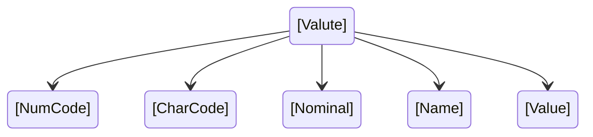

# Как распарсить `xml`-файл на **Python**?

***

Я покажу! 

Мы заберем по специальной ссылке с сайте ЦБ РФ
[курсы валют](https://www.cbr.ru/scripts/XML_daily.asp?date_req= "Курсы валют, устанавливаемые ЦБ РФ ежедневно"),
страницу `xml` с курсами валют, устанавливаемых ежедневно.

```xml
<ValCurs Date="26.08.2023" name="Foreign Currency Market">
<Valute ID="R01010">
<NumCode>036</NumCode>
<CharCode>AUD</CharCode>
<Nominal>1</Nominal>
<Name>Австралийский доллар</Name>
<Value>60,7765</Value>
</Valute>
...
```

И разберем однородные данные по каждой валюте в отдельные списки, к которым потом можно обращаться по индексу:



Я добавляю в коде сегодняшнюю дату, но ничто не мешает еам добавить одну строку для получения даты
от пользователя или передавать ее откуда-то ещё.

Все получченные данные я разбросаю раздельно по спискам, чтобы потом можно было оперировать раздельно
каждым. 
Еще будет красивый форматированный вывод данных в виде таблице, в которой данные выровнены по одной линии, что позволяет очень
удобно читать информацию. Еще как дополнительная опция, есть вывод в текстовый `txt` файл. Просто как дополнение, можно дальше пользоваться.

[currency.txt](https://github.com/Serjio-Pescador/parse-cbr-currency/files/12443797/currency.txt)

---

Example

 1  |  2  |  3 | 4 | 5 |
--- | --- | :--- | :---------------------------------------- | --------:
036 | AUD | 1 | Австралийский доллар | 61,1622
944 | AZN | 1 | Азербайджанский манат | 55,5298
826 | GBP | 1 | Фунт стерлингов Соединенного королевства | 119,7284
051 | AMD | 100 | Армянских драмов | 24,4587
933 | BYN | 1 | Белорусский рубль | 29,8642
... | | | | 
392 | JPY | 100 | Японских иен | 65,2029
